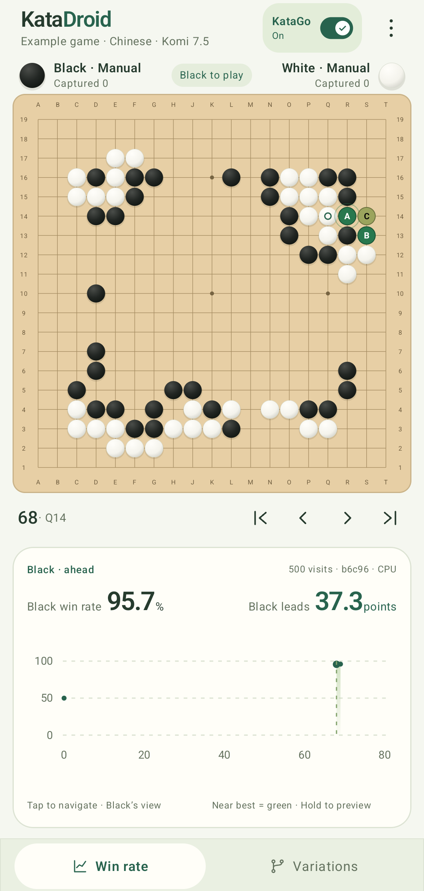
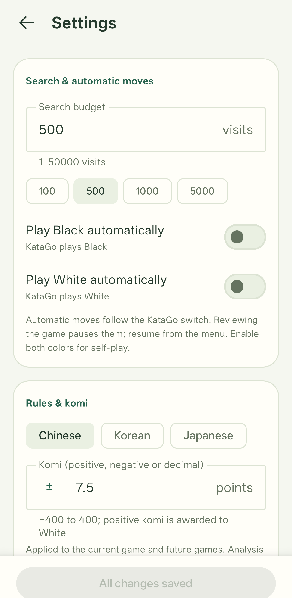
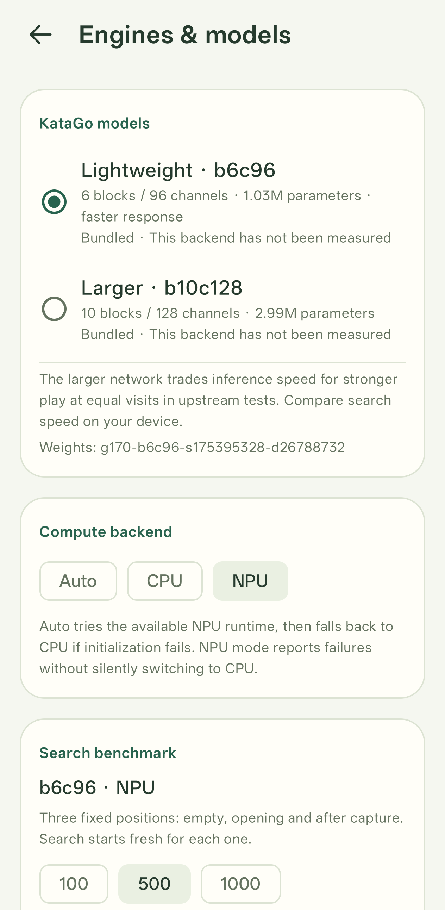

# KataDroid

[简体中文](README.zh-CN.md) · [User guide](docs/android-ui.md) · [Architecture](docs/katago-integration.md) · [Performance](docs/models-and-benchmarks.md)

An Android Go board with offline KataGo analysis, variations and SGF editing.
The app runs the official KataGo search and rules engine locally, with LiteRT
neural inference. No account or analysis server is required.

<p align="center">
  
  
  
</p>

## Features

- Play either color manually, let KataGo play Black or White, or enable both for self-play.
- Toggle analysis from the top-right switch; set an initial/history/automatic-play budget from 1 to 50,000 visits.
- Candidate colors reflect **win-rate loss relative to the best evaluated move**,
  from the player-to-move perspective: near-best green, then yellow, then red.
  Three near-equal opening moves can all be green at about 50% win rate.
- Hold a candidate to preview its variation. Tap the win-rate chart or a tree
  node to navigate the game; earlier branches and saved analyses remain available.
- Opening a game analyzes the current position first, then fills the whole SGF's
  history and variations to build a win-rate curve from the opening onward.
  Once history is complete, the selected position keeps searching until KataGo is paused.
  Live search snapshots refresh about every 250 ms.
- Candidate markers are hidden whenever either player is automatic; win rates remain available.
- Import/export 19×19 SGF with variations, comments, player metadata and root setup stones.
  Player panels display SGF names and ranks (kyu, dan or professional).
- Chinese, Japanese and Korean rules; komi from −400 to 400, including decimals.
- Physical-pixel touch offset, drag-to-preview placement and a larger landscape board.
- Switch between bundled b6c96 and b10c128 networks, select Auto / CPU / NPU,
  and measure actual search **visits/s** on three fixed positions.
- English and Simplified Chinese interfaces, following Android's app/system language.

## How to use

Download from [GitHub Releases](https://github.com/zhzy0077/KataDroid/releases).
Choose **arm64-v8a** for phones and tablets, **x86_64** for x86 devices/emulators,
or the universal APK for both architectures. ARMv7 is not supported.

Build and install the app using the instructions below. Open the three-dot menu
to **Clear board**, **Import SGF**, **Export SGF** or open **Settings**. Tap an
intersection to play. The KataGo switch enables analysis; both colors are manual
by default. In Settings, edit the desired options and tap **Apply all changes**
once at the bottom. If automatic play is paused, tap **Resume auto** in the
player status area to continue. Open **Engines & models** to choose a model and
benchmark it.

Android 13+ supports choosing English or Chinese in system Settings → Apps →
KataDroid → Language. The app initially opens the first 50 moves of AlphaGo–Lee Sedol, game 4
(2016-03-13); analysis and candidate values come from real search.

## Device and SoC compatibility

KataDroid targets **Android 13 / API 33 or newer**, with `arm64-v8a` and `x86_64`
builds. CPU inference works independently of phone brand or SoC; the app has no
model or SoC allowlist. NPU acceleration depends on the plugins included in your
APK, the device's vendor drivers and the selected network.

| Device / SoC or environment | Backend | Current test coverage |
| --- | --- | --- |
| Qualcomm Snapdragon 8 Elite device | LiteRT / QNN NPU | b6c96 numerical, search and native delegation checks passed. The combined both-model benchmark/lifecycle audit did not complete; b10c128 performance remains unverified. |
| MediaTek Dimensity 9300 (MT6989) device | LiteRT / Neuron NPU, experimental | b6c96 and b10c128 numerical, search/lifecycle and benchmark checks passed with native delegation evidence, using patched plugins. |
| Android Studio x86_64 AVD, API 37 | CPU | UI and CPU regression baseline; performance depends on the host computer. |
| Other phones / SoCs | CPU; NPU where a compatible runtime is available | Compatibility feedback welcome. The results above do not establish support for other SoC generations or every phone with the same SoC. |

A clean checkout builds a **CPU-capable APK**. NPU plugins are optional:
see [NPU setup](docs/npu.md) for Qualcomm setup and the experimental MediaTek
source build and runtime patch. Samsung NPU plugins are not included.
**Auto** tries a packaged NPU runtime and falls back to CPU if initialization
fails. Explicit **NPU** mode reports errors instead of silently switching backend.
Check the actual backend shown in the app when reporting a result.

## Measured performance

These are real KataGo search **visits per second**, including search and inference
work. Initialization and warm-up are excluded. Each run measures three fresh
positions after a 32-visit warm-up; all results below use debug builds.

| Environment / actual backend | Visits per position | b6c96 visits/s | b10c128 visits/s |
| --- | ---: | ---: | ---: |
| Snapdragon 8 Elite / NPU, Android 17 | 500 | 665.0 (exploratory) | Unverified |
| MediaTek Dimensity 9300 (MT6989) / NPU, Android 16 | 500 | 276.1 | 225.9 |
| Android Studio API 37 AVD / CPU | 100 | 121.8 | 44.8 |

The Snapdragon b6 result is from a completed individual measurement; the combined
both-model audit was interrupted. The MediaTek results are from a completed
native delegation audit with LiteRT 2.2.0 and Neuron USDK 8.2.26. AVD numbers are
host-dependent simulator results, not phone CPU measurements, so these rows
cannot establish a CPU-to-NPU speedup. Short runs do not establish sustained
thermal performance, battery use or playing strength.

See [models, methodology and sanitized measurements](docs/models-and-benchmarks.md)
for timings, runtime details and validation limits. In the app, open
**Engines & models** to benchmark your own device. b6c96 is the lighter network;
b10c128 is larger. More visits/s alone does not mean stronger play.

## Share compatibility test feedback

**Reports from other devices are welcome, including failures and CPU fallback.**
[Open a compatibility report](https://github.com/zhzy0077/KataDroid/issues/new)
with:

- Phone manufacturer and model, **SoC name** and Android version.
- App version or commit, APK source, and which NPU plugins were packaged, if known.
- Selected model (b6c96 or b10c128), requested backend (Auto / CPU / NPU), and the
  **actual backend** reported by the app.
- Whether analysis and automatic play work; for a benchmark, include visits per
  position and measured visits/s for each tested model.
- For a failure, the error message and steps to reproduce. Mention warm/cold runs,
  repeated runs or noticeable heating when relevant to performance.

App benchmark results are useful compatibility feedback. A claim of validated
NPU execution also needs native delegation evidence; selecting NPU or completing
CPU fallback does not prove the NPU ran. Contributors can use the
[dedicated NPU audit](docs/npu.md). Share sanitized results and app-only screenshots;
omit device serials, account details and local paths.

## Build

Use Android Studio with API 37 support, or the Gradle wrapper. Toolchain:
Gradle 9.6.0, JDK 25 (Gradle daemon), Android SDK 37.0 (API 37), Build Tools 36.0.0,
NDK 28.2.13676358 and CMake 3.22.1. Java source compatibility is 11.
Set the SDK path through Android Studio or your own ignored `local.properties`.

```bash
./gradlew :app:assembleDebug
adb devices -l
adb -s <target-serial> install -r app/build/outputs/apk/debug/app-debug.apk
```

The included assets make a CPU build possible without Python, model downloads or
conversion tools. For the optional NPU plugins, see [NPU setup](docs/npu.md).
Release APKs require your own signing configuration; never commit signing keys.
Pushing a version tag such as `v1.0.0` builds signed arm64-v8a, x86_64 and
universal APKs and publishes them as a GitHub Release once the repository's signing secrets are configured. See
[tagged APK release setup](CONTRIBUTING.md#tagged-apk-releases).

```bash
python3 tools/check_integrity.py
./gradlew :app:testDebugUnitTest :app:lintDebug :app:assembleDebugAndroidTest
```

AVD instrumentation commands are in [CONTRIBUTING.md](CONTRIBUTING.md).

### How it works

Compose UI → game/SGF state → serialized analysis controller → JNI → official
KataGo rules, features and search → LiteRT CPU or optional NPU inference.
Models and actual backends have separate result caches. Search and benchmark
jobs share a single worker, so cancelled jobs cannot publish stale moves or free
buffers while native inference still uses them.

See [architecture](docs/katago-integration.md) and [model conversion](docs/model-conversion.md).

## License

KataDroid code is [MIT](LICENSE). KataGo source, external libraries, CC0 g170
weights and vendor runtime terms are documented in [Third-party notices](THIRD_PARTY_NOTICES.md).
