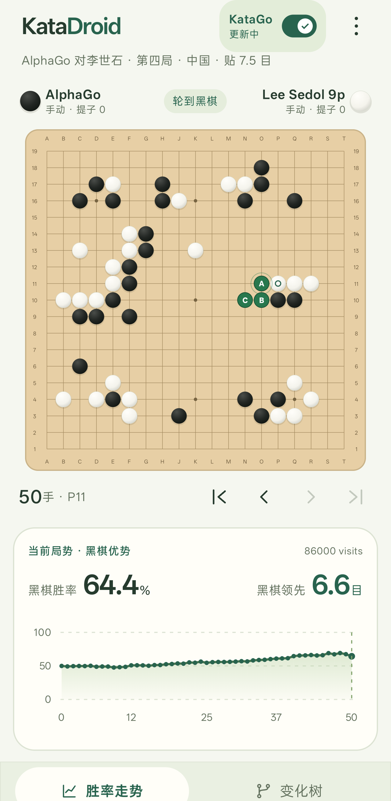
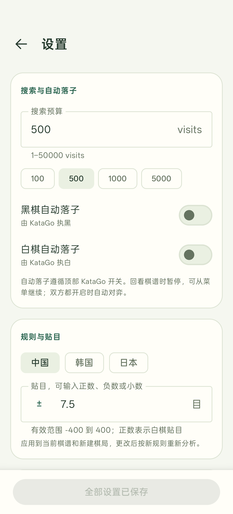

# KataDroid

[English](README.md) · [使用说明](docs/usage.zh-CN.md) · [技术架构](docs/katago-integration.md) · [模型与性能](docs/models-and-benchmarks.md)

在 Android 上离线运行 KataGo，支持对弈、局面分析、变化树和 SGF 棋谱编辑。
使用官方 KataGo 的规则与搜索，通过 LiteRT 在本机完成神经网络推理，无需账号或分析服务器。

<p align="center">
  
  
</p>

## 功能

- 双方手动落子，或分别设置黑棋、白棋自动落子；双方开启时自动对弈。
- 右上角 KataGo 开关控制分析，搜索上限可设为 1–50,000 visits。
- 候选点按**当前行棋方相对最佳选点的胜率损失**从绿、黄到红着色。
  开局约 50% 时，接近最佳的前三个选点可以全部为绿色。
- 长按候选点预览变化；点击胜率走势、变化树或前后手按钮跳转。没有定时自动回放。
- 导入、导出 19 路 SGF，保留主线、变化、注释、棋手信息和根节点摆子。
- 中国、日本、韩国规则，支持 −400 到 400 的任意小数贴目。
- 落点向手指上方偏移、拖动预览、松手落子；横屏扩大棋盘。
- 内置 b6c96、b10c128 模型，支持自动 / CPU / NPU 选择与真实搜索 visits/s 测速。
- 中文和英文界面，跟随 Android 的应用语言或系统语言。

## 开始使用

安装后通过右上角三点菜单清空棋盘、导入或导出 SGF、进入设置。
点击棋盘落子，双方默认手动。打开右上角 KataGo 开关开始分析。
设置中的所有修改由底部「应用全部设置」统一保存；引擎页面可直接切换模型和测速。
首次启动显示示例棋谱，其胜率和推荐点由引擎实际计算。

语言可以在 Android 系统设置 → 应用 → KataDroid → 语言中切换。
更多操作见[中文使用说明](docs/usage.zh-CN.md)。

## 设备支持

Android 13 / API 33 及以上，提供 arm64-v8a 和 x86_64 构建，**不按机型或 SoC 设置白名单**。
CPU 推理不依赖手机品牌。自动模式尝试安装包中的 NPU 运行时，初始化失败时使用 CPU；
手选 NPU 会明确报告错误。可选 NPU 集成包括 Qualcomm LiteRT/QNN 和实验性的 MediaTek Neuron；
联发科插件需要从带补丁的 LiteRT 源码构建，见 [NPU setup](docs/npu.md)。尚未接入 Samsung NPU。

日常界面、功能和 CPU 测试使用 Android Studio 模拟器；真机 NPU 验证覆盖了
**Snapdragon 8 Elite 和 MediaTek MT6989**。这是测试覆盖范围，不是 App 使用限制。
性能数据、统计口径和未完成的验证见[模型与性能说明](docs/models-and-benchmarks.md)。

## 构建

需要支持 API 37 的 Android Studio，或使用 Gradle Wrapper：Gradle 9.6.0，Gradle 守护进程
JDK 25，SDK 37.0（API 37）、Build Tools 36.0.0、NDK 28.2.13676358、CMake 3.22.1。
通过 Android Studio 或本地 `local.properties` 设置 SDK 位置。模型已内置，CPU 构建无需 Python。

```bash
./gradlew :app:assembleDebug
adb devices -l
adb -s <目标序列号> install -r app/build/outputs/apk/debug/app-debug.apk
```

可选 NPU 准备见 [NPU setup](docs/npu.md)，验证命令见 [CONTRIBUTING.md](CONTRIBUTING.md)。
发布 APK 需自行配置签名，签名材料不应提交到仓库。

## 技术架构

Compose 界面 → 棋谱与 SGF 状态 → 串行分析控制器 → JNI → 官方 KataGo 规则、特征和搜索 → LiteRT 推理。
CPU 或 NPU 只负责网络推理，合法性、历史规则与搜索仍由 KataGo 完成。
按模型哈希和实际后端隔离分析缓存；搜索与测速共用串行工作线程，切换局面、模型或退出时取消旧任务。
详见[架构说明](docs/katago-integration.md)和[模型转换](docs/model-conversion.md)。

## 协议

项目原创代码使用 [MIT](LICENSE)。第三方源代码、CC0 g170 模型以及厂商运行库各自的许可见
[THIRD_PARTY_NOTICES.md](THIRD_PARTY_NOTICES.md)。
