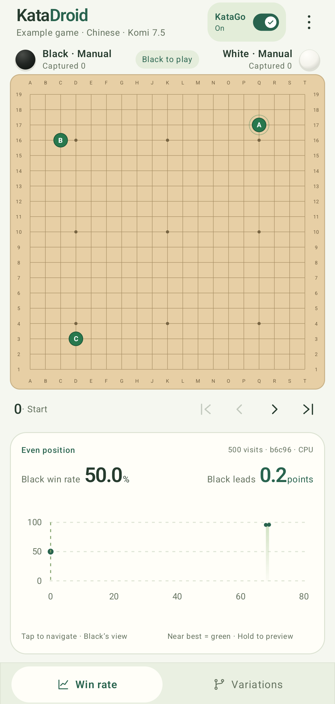
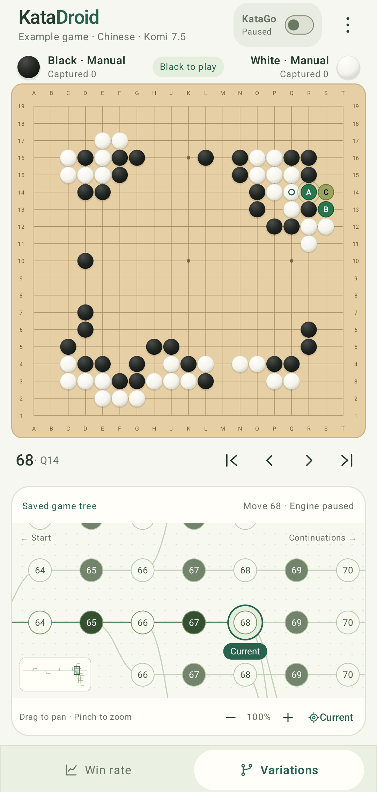
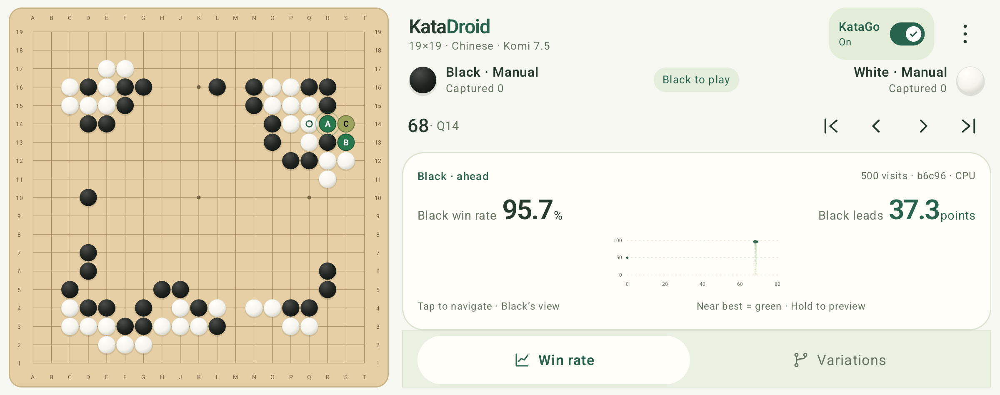

# User guide

[中文使用说明](usage.zh-CN.md) · [README](../README.md)

## Board and analysis

The first launch opens an illustrative 19×19 record. Open the three-dot menu and
choose **Clear board** to start a fresh game using the current rules and komi.
Both players are manual by default. Tap a legal intersection to play; an occupied
point, suicide forbidden by the rules or a ko violation is rejected by KataGo.
Use **Pass** in the menu to pass a turn.

The top-right KataGo switch controls analysis. Turning it off retains saved
results. A position without saved analysis shows no invented win rate or moves.
The graph and headline percentage use Black's perspective; candidate colors use
the player whose turn it is.

Candidate labels A/B/C preserve KataGo's recommendation order. Their colors show
loss against the best evaluated legal candidate: up to 2 percentage points is
green, 5 points is yellow and 10 or more is red, with gradients between. This is
relative quality, not an absolute 0–100% color scale. Three similar opening moves
can all be green around 50%. An unsearched point is not colored merely because
its coordinate looks bad; there must be an engine evaluation.

Tap a candidate to play it. Hold it to preview up to three moves from its search
variation; a pass recommendation has a preview entry in the analysis panel.
Preview moves do not change the SGF. **Exit preview** or Android Back restores
the original game position.

## Navigate and edit

Use the first/previous/next/last buttons or tap the win-rate chart. The chart keeps
the full selected branch when navigating backward, so later moves remain
reachable. Unanalyzed positions remain selectable; graph lines only connect
adjacent analyzed positions. Preview points never become real record nodes.

The **Variations** tab displays the entire game tree. Tap a node to select a
branch; drag to pan, pinch or use +/− to zoom, and use Current to return to the
selected node. Playing from a historical node creates a variation. Navigation
pauses automatic moves; resume them explicitly from the menu.

## Settings

All board, search, automatic-player, rule and komi controls edit a draft. Nothing
in that draft changes the current game until **Apply all changes** is pressed.
The single action remains at the bottom while scrolling. Invalid numbers disable
it, and rule changes are validated before any part of the draft is saved. Apply
before leaving Settings; an unapplied draft survives Activity recreation but is
not committed when navigating away.

- **Search limit:** 1–50,000 visits per position; default 500. Larger budgets take longer.
- **Automatic moves:** enable Black, White or both. The KataGo switch must also be on.
- **Rules and komi:** Chinese, Korean or Japanese; −400 to 400, including decimals.
  Positive komi is awarded to White. Rule changes apply to the current record and
  future games and trigger fresh analysis.
- **Touch offset:** 0–300 physical pixels above the finger, with 0/60/120 presets.
  Drag to preview and release to play. The extra touch area below the board makes
  its bottom row reachable even with an offset.
- **Coordinates/candidates:** show or hide their overlays.

Landscape places the controls beside the board to preserve board height.

## Files, models and language

**Import SGF**, **Export SGF** and **Clear board** are in the three-dot menu.
Import/export uses Android's system document picker; no broad storage permission
is needed. See [SGF support](game-settings.md) for supported properties and limits.

Settings → **Engines & models** switches networks and backends immediately. A
switch cancels old work. **Test performance** measures three fresh searches and
shows visits/s, initialization and warm-up separately. Auto can fall back to CPU;
the completed result records the actual backend. See [performance](models-and-benchmarks.md).

Change the app language under Android Settings → Apps → KataDroid → Language.
English and Simplified Chinese are included; other system languages use English.
