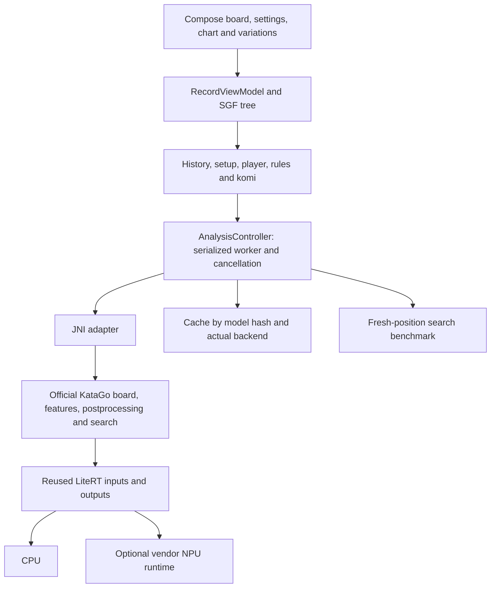

# Architecture

KataDroid uses **KataGo v1.18.2** for rules and search. Neural inference is supplied
through LiteRT 2.2.0. The integration does not replace KataGo with a policy-only
move picker or a handwritten approximation of its rules.

## Source layout

| Path | Responsibility |
| --- | --- |
| `ui/record/` | Board input/drawing, candidate color, chart, game tree and document state |
| `ui/` | Navigation, settings draft, preferences and engine selection |
| `sgf/` | SGF codec, metadata and branch conversion |
| `engine/AnalysisController.kt` | Serialized lifecycle, progressive search, cancellation and publication |
| `engine/LiteRtNetwork.kt` | Verified model pair, reusable tensors and JNI session |
| `engine/SessionFactory.kt` | Backend selection and Auto initialization fallback |
| `engine/SearchBenchmark.kt` | Reproducible visits/s measurement and persistence |
| `app/src/main/cpp/katago_jni.cpp` | Official rules/features/search adapter and LiteRT NN backend |
| `third_party/katago/` | Unmodified upstream subset with SHA-256 inventory |

The Kotlin paths are relative to `app/src/main/java/com/example/katadroid/`.

## Search and lifetime

Search uses one search worker, one neural server worker and batch size one.
Progress is published at 32, 128, then 500-visit intervals up to the selected
limit; 500 is a configurable default. JNI joins the neural thread before LiteRT
tensors, the compiled model and environment are freed.

Every UI request has an epoch and cancellation token. Leaving the board,
backgrounding, disabling the engine, opening the file picker, switching models
or starting a benchmark cancels old work. Late completions cannot overwrite the
new position or trigger automatic play. Analysis and benchmark share the worker,
so their runtimes cannot overlap. Automatic moves require a fresh completed
result for the exact current position, selected model/backend and visit budget.
A deeper saved result can remain visible while a smaller new search runs.

## State, cache and backend selection

Position identity includes complete history, explicit colors/PL, root setup,
rules and komi. Each model's TFLite and original descriptor are verified against
pinned hashes. The original descriptor provides official postprocessing metadata;
the TFLite executes the network. The adapter retains all five output heads.

CPU is always an available selection for supported APK ABIs. There is no SoC or
phone-model allowlist. If NPU runtime files are packaged, Auto attempts NPU
initialization, catching initialization/linker failures and opening CPU instead.
Explicit NPU requests propagate errors. NPU tensor boundaries must be QNN-backed;
full graph delegation additionally requires the native-log audit.

Analysis files and benchmark results are keyed by model hash and **actual** CPU
or NPU backend. Auto can display the last completed backend's saved results while
idle; when opening a runtime it reloads the matching cache before publishing new
analysis. A CPU fallback cannot be saved as an NPU result.

## UI semantics and language

Candidate color uses current-player win-rate loss from the best evaluated legal
candidate (including pass), with a 2-point green plateau and 5/10-point yellow/red
anchors. It does not stretch just A/B/C across all colors. The win-rate graph uses
Black's perspective. TalkBack descriptions include both win rate and relative loss.

The chart retains the whole selected continuation, including moves after the
current selection. Same-hand SGF comment/PL nodes keep the selected position
exact. Unanalyzed nodes are navigable but are not interpolated as known values.

English is the default Android resource locale; `values-zh` supplies Chinese.
Compose reads `LocalResources` so configuration changes update the text.
Game identifiers and generated branch keys are locale independent; imported SGF
names and comments remain user data. A settings draft is saved with one persistent
Apply action after complete validation. There is no timer-based record replay.
