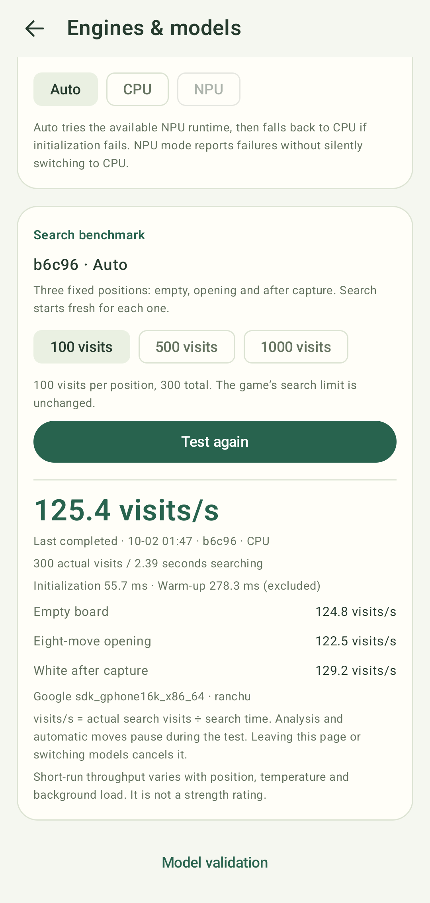

# Models and performance

[User guide](android-ui.md) · [Architecture](katago-integration.md) · [Conversion](model-conversion.md)

## Model choice

| Network | Size | Intended tradeoff |
| --- | --- | --- |
| b6c96 | 6 blocks, 96 channels, about 1.03M parameters | Lower inference cost and faster interactive analysis |
| b10c128 | 10 blocks, 128 channels, about 2.99M parameters | Larger network; stronger at equal visits in upstream g170 testing |

Both are older official g170 networks, paired with verified 19×19 version-8
TFLite exports. They are useful lightweight mobile baselines, not the latest or
strongest KataGo networks. Equal visits do not mean equal thinking time or equal
strength across networks. See the upstream [g170 network notes](https://katagoarchive.org/g170/neuralnets/README.txt).

The app allows switching these bundled pairs. It does not yet accept arbitrary
model files; newer architectures may need a different output contract and export
path. No retraining was needed for these two conversions.

## What visits/s measures

The engine page runs one 32-visit warm-up followed by fresh searches of an empty
board, an eight-move opening and a position after a capture. Each measured
position starts with the search tree and NN cache cleared. Choose 100, 500 or
1,000 visits **per position**. The benchmark's budget is separate from the game's
search setting.

Throughput is **total actual visits / total search time**, not an average of
individual rates, and not `1000 / neural inference latency`. Progressive visit
counts are cumulative and counted once. Initialization and warm-up are reported
separately and excluded from throughput. This is the single-threaded search used
by the app; serialization, JNI and synchronous inference contribute to its cost.

Models and actual CPU/NPU backends have separate saved results. Leaving the page,
cancelling or switching models invalidates an incomplete run. Auto results record
the backend that actually opened, including CPU fallback.

This screenshot shows a separate AVD run using Auto, which selected CPU. Its
125.4 visits/s result illustrates the report; the recorded baseline below comes
from a different run.

## Amended official v1.0.0 (version code 1003)

The P0 combined-dispatch bug was fixed and the maintainer requested an amended
v1.0.0. The tag points to `69f68fd82531132a47c26fcbb5ac2a558952a36e`;
the [official Release APK workflow](https://github.com/zhzy0077/KataDroid/actions/runs/37034321350)
built and signed universal, arm64-v8a and x86_64 APKs. All downloaded APKs matched
published checksums; the arm64 signing certificate matches the original release.
Both physical devices received the actual arm64 asset, not a locally built substitute.

Measured on 2026-10-03 with three trials per configuration, each using a fresh
production-controller session, a 32-visit warm-up and three fresh positions at
500 visits each. Initialization and warm-up are excluded. The app remained awake
in the foreground and ordinary analysis was temporarily paused, then restored.
The user enabled performance mode on Dimensity; Snapdragon's setting was not recorded.

| SoC / actual backend / model | Median visits/s | Trial range visits/s |
| --- | ---: | ---: |
| Snapdragon 8 Elite / NPU / b6c96 | 776.0 | 770.4–780.6 |
| Snapdragon 8 Elite / NPU / b10c128 | 499.5 | 491.0–504.6 |
| Dimensity 9300 / CPU / b6c96 | 94.6 | 94.1–94.6 |
| Dimensity 9300 / CPU / b10c128 | 21.2 | 20.3–21.6 |
| Dimensity 9300 / NPU / b6c96 | 340.1 | 338.7–340.2 |
| Dimensity 9300 / NPU / b10c128 | 272.8 | 270.7–274.0 |

Native logs verified complete XNNPACK CPU or vendor DispatchDelegate NPU graphs,
with QNN/FastRPC/DMA-BUF on Snapdragon and Neuron/AHWB/DMA-BUF on Dimensity.
All six Snapdragon NPU and six Dimensity CPU runtime openings have delegate
records. Dimensity NPU logs retained one graph assignment per model, rather than
all three openings; all rounds passed strict NPU buffer/backend checks. Its
per-trial native trace is therefore incomplete. Both devices passed b6/b10 numerical,
search/cancellation/restart/model-switch and timed-search tests. Both completed
all 51 sample positions at 500 visits each, then searched the selected position
beyond 500. These are engine integration tests, not substitutes for AVD UI tests.

These are short tests, not sustained thermal, battery or playing-strength results.
Snapdragon CPU performance was not measured. Older APK measurements below are
retained with their original digests and version codes.

Sanitized build identities, all timings and per-position counters:
[Snapdragon production results](benchmarks/snapdragon-8-elite-amended-release.json),
[Dimensity production results](benchmarks/dimensity-9300-amended-release.json),
and [official release validation](benchmarks/amended-v1.0.0-validation.json).

## Original production v1.0.0 (version code 1002): Dimensity 9300

Measured on 2026-10-02 using the APK downloaded from the published v1.0.0 release,
Android 16 and **MediaTek Dimensity 9300 (MT6989)**. Version code 1002, non-debuggable;
its SHA-256 and release signature were verified before installation. Instrumentation
contains no KataGo/LiteRT native libraries, so measurements use the installed
production runtime.

Each configuration completed three trials of three fresh positions × 500 visits,
with a 32-visit warm-up per trial. Initialization and warm-up are excluded.
Each trial used a fresh session through the production benchmark controller.
The user enabled performance mode. The app stayed awake in the foreground,
with ordinary analysis paused and restored afterward;
no display settings were changed. Compilation caches were warm and the phone was on battery.

| Model / actual backend | Median visits/s | Trial range visits/s |
| --- | ---: | ---: |
| b6c96 / CPU | 94.1 | 93.5–95.0 |
| b10c128 / CPU | 21.3 | 21.1–21.4 |
| b6c96 / NPU | 343.4 | 341.5–362.6 |
| b10c128 / NPU | 271.5 | 270.5–271.5 |

All four instrumentation runs passed without skips. Native logs assigned the complete
CPU graphs to XNNPACK and the complete NPU graphs to DispatchDelegate, loaded the
MediaTek NeuronAdapter, passed the Neuron 8.2.26 graph/runtime version check, and
reported AHWB/DMA-BUF at all NPU boundaries. There was no CPU graph delegation in
NPU runs. Cached NPU graphs appear as a single serialized graph node.

Configurations ran sequentially: NPU b6c96, NPU b10c128, CPU b6c96, CPU b10c128.
The user-reported b6 480 visits/s was not reproduced; b10 was close to the reported 273.
These measurements do not isolate scheduling effects or establish sustained thermal
performance, battery consumption or playing strength. Earlier background attempts
were interrupted by the device's background manager and are excluded from the table.

Sanitized build identity, all 12 trials and per-position counters/timings:
[dimensity-9300-production.json](benchmarks/dimensity-9300-production.json).

## Measured development baseline

Measured on 2026-10-02 with a debug build, Android Studio API 37 x86_64 AVD,
16 KiB pages. Each model completed 3 × 100 measured visits, after warm-up.
These are **host-dependent simulator measurements**, not phone CPU figures.

| Model / actual backend | visits/s | Search total | Initialization | Warm-up |
| --- | ---: | ---: | ---: | ---: |
| b6c96 / CPU | 121.8 | 2.463 s | 59.1 ms | 271.9 ms |
| b10c128 / CPU | 44.8 | 6.693 s | 134.6 ms | 708.0 ms |

Sanitized per-position counters and timings: [avd-cpu.json](benchmarks/avd-cpu.json).
The two models' raw outputs and official postprocessed values were checked
against reference positions, separately from throughput measurements.

## Prior physical NPU work

The prior Qualcomm physical SoC tested is **Snapdragon 8 Elite** with Android 17,
LiteRT 2.2.0 and QNN 2.47.0. This is validation coverage, not a device allowlist.
These earlier measurements predate the combined-plugin release audit below.

A previous exploratory b6c96 NPU benchmark completed 3 × 500 visits at **665.0
visits/s** (2.256 s search, 71.8 ms initialization and 69.1 ms warm-up). Its
sanitized counters are in [prior-npu-b6.json](benchmarks/prior-npu-b6.json).
The same test process was subsequently killed during b10 testing: **the combined
both-model benchmark/lifecycle/delegation audit did not complete**. This single
b6 measurement must not be presented as a passing full-suite or sustained-load
result. Separate earlier b6 numerical/search/cancellation/reopen and native
QNN delegation checks did pass. b10 raw/postprocessed NPU precision checks passed,
but that earlier run did not establish a complete b10 benchmark/lifecycle result.

Do not compare the AVD table with that phone as a CPU-vs-NPU speedup experiment:
they are different environments and visit budgets. Temperature, background load,
compiler caches and search position affect throughput. Sustained thermal behavior,
battery use and playing strength have not been measured.

## Combined-plugin release audit and fix

The original published v1.0.0 arm64 APK was verified by digest on Snapdragon 8 Elite.
Its NPU search failed: LiteRT selected the MediaTek dispatch library despite
Qualcomm compiler selection, then failed Neuron initialization and produced
`HostMemory` boundary buffers. CPU results cannot validate this NPU path.

A release-signed, non-debuggable **1.0.1 candidate** uses vendor-specific plugin
directories. Both Snapdragon 8 Elite and Dimensity 9300 passed convolution and
b6/b10 numerical/reference checks, both-model search, cancellation, reopen/model
switch and timed-search checks. Native logs loaded the selected vendor dispatch,
assigned the complete observed graphs to DispatchDelegate, and reported
FastRPC/DMA-BUF on Qualcomm or AHWB/DMA-BUF on MediaTek.

Both devices also completed all **51 sample positions at 500 visits each**, then
continued the selected position beyond 500. An additional check against the
original v1.0.0 on Dimensity completed all 51 positions at a 32-visit initial
budget and continued searching. These are engine/controller integration checks;
they do not substitute for AVD UI regression tests. The UI supplies this same
record history and enables continuous analysis in manual review mode. During
history completion, the selected position can remain at its initial visit budget.

The candidate preceded the official amended v1.0.0 rebuild and device
verification documented above.
The original production timings above identify the original APK by version code
and digest; they are not measurements of the amended APK.
Sanitized build identity and validation:
[vendor-isolation-validation.json](benchmarks/vendor-isolation-validation.json).

## MediaTek Dimensity 9300 (MT6989) NPU validation

Measured on 2026-10-02 with Android 16, a debug build, LiteRT 2.2.0 and the
device's public Neuron USDK 8.2.26 runtime. The compiler and dispatch plugins were
built from matching LiteRT source with the [runtime selection patch](npu.md).
Unpatched plugins selected the older MGVI 7.3.19 library, which failed APU device
access and crashed during compilation, even for the convolution probe.

The patched b6 numerical probe, official JNI search/cancellation/reopen suite,
and b10 numerical plus both-model benchmark/cancellation/switch suite completed.
Native audits confirmed Neuron graph loading and complete DispatchDelegate
assignment for every runtime; NPU boundaries used AHWB/DMA-BUF. LiteRT registers
CPU/GPU accelerators and can construct an idle XNNPACK delegate, but no graph
nodes were assigned to a CPU delegate in these NPU runs.

The fully audited benchmark run used a 32-visit warm-up and three fresh positions
of 500 visits each. Initialization below used the on-device compilation cache.

| Model / actual backend | visits/s | Search total | Initialization | Warm-up |
| --- | ---: | ---: | ---: | ---: |
| b6c96 / NPU | 276.1 | 5.433 s | 106.1 ms | 166.8 ms |
| b10c128 / NPU | 225.9 | 6.639 s | 181.4 ms | 160.6 ms |

Sanitized counters: [mediatek-npu.json](benchmarks/mediatek-npu.json).
A preceding functional run measured 314.6 and 225.2 visits/s respectively, but its
combined native audit lacked some log records. These short runs show variability;
they do not establish sustained thermal performance or a CPU-vs-NPU speedup.
No CPU benchmark or UI test was run during that earlier debug audit. The production
CPU performance work above was explicitly scheduled separately.

## 中文说明

引擎页面的 visits/s 来自三个固定局面的真实搜索访问数除以搜索时间，初始化和预热另计。
它不是单次网络延迟的倒数，也不能直接当作棋力。两个模型、CPU 和 NPU 的结果分开保存。

本次模拟器中 b6c96 / CPU 约 121.8 visits/s，b10c128 / CPU 约 44.8 visits/s，均为每局面 100 visits。
这些数字依赖宿主机，不代表手机 CPU 性能。此前 8 Elite 上完成的一次 b6 NPU 探索测速为
665.0 visits/s、每局面 500 visits；随后 b10 测试进程被系统结束，因此此前未能完成双模型专项。
上述 1.0.1 签名候选版本已在两种 SoC 上完成双模型 NPU 专项和全历史持续分析验证。本次 MT6989 的完整 NPU 审计通过，b6c96 / b10c128 在每局面 500 visits 时
分别为 276.1 / 225.9 visits/s；此前一轮短测为 314.6 / 225.2 visits/s。
这些结果不能与模拟器数据直接计算加速比，尚未进行持续温升、功耗和棋力评测。
